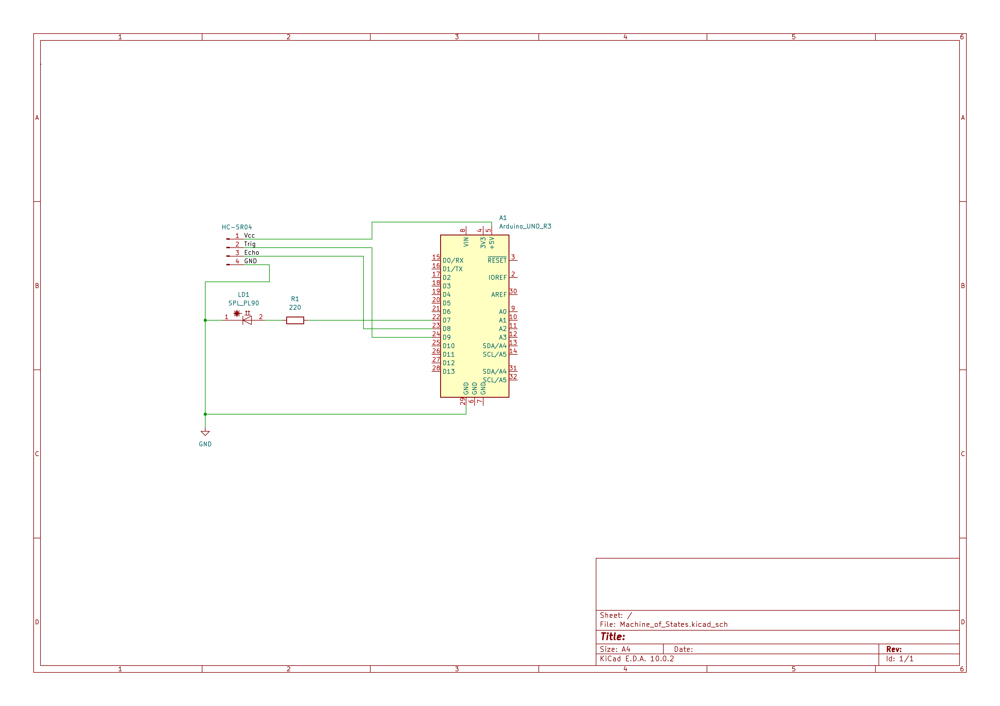

# Nucleo Distance Alarm 🚀

A project based on the **NUCLEO-G431RB** (STM32) microcontroller, using an HC-SR04 ultrasonic sensor and a state machine for object detection. When an object comes closer than 15 cm, the system triggers an alarm and lights up a red LED.

## 🛠️ Hardware

* NUCLEO-G431RB (or any other board with Arduino Uno R3 pinout mapping)
* HC-SR04 ultrasonic distance sensor
* Red LED (5mm)
* 220Ω / 330Ω resistor
* Breadboard and jumper wires

## 🔌 Wiring (Pinout)

| Component | Component Pin | Nucleo Pin |
| :--- | :--- | :--- |
| **HC-SR04** | VCC | 5V |
| **HC-SR04** | GND | GND |
| **HC-SR04** | Trig | D9 |
| **HC-SR04** | Echo | D8 |
| **LED** | Anode (+) | D7 (through 220Ω resistor) |
| **LED** | Cathode (-) | GND |

## ⚙️ How It Works (State Machine)

The program is built around a non-blocking state machine, which allows smooth operation without using `delay()` calls.

1. **STATE_IDLE:** After startup, the board waits for user interaction.
2. **STATE_MEASURING:** After pressing the *Blue Button (User Button)* on the Nucleo board, the system starts measuring distance every 500 ms. Results are printed to the serial monitor.
3. **STATE_ALARM:** If the measured distance drops below 15 cm, the alarm activates, the LED turns on, and measurements are paused. To clear the alarm and return to measuring, press the *User Button* again.

## 🖼️ Schematic

*(A detailed vector-format schematic is available in the `schematic.pdf` file)*

## 💻 How to Run

1. Clone the repository: `git clone https://github.com/YOUR_USERNAME/Nucleo-Distance-Alarm.git`
2. Open the code from the `software` folder using **Arduino IDE**.
3. Make sure you have the STM32 board package installed (Board Manager → STM32 MCU based boards).
4. Select the board: *Nucleo-64* → *Nucleo G431RB*.
5. Compile and upload the program to the microcontroller.
6. Open the Serial Monitor (115200 baud) to see distance readings and system messages!